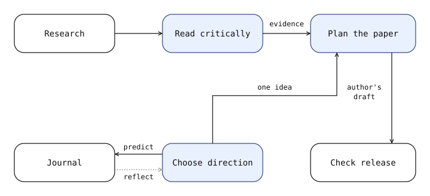

# research-credo

Agent skills for choosing research questions, developing judgment, and keeping sources useful across sessions. Works with Claude Code and Codex.



## Skills

| Skill | Use it to |
| --- | --- |
| [credo-taste](skills/credo-taste/SKILL.md) | Choose a direction and decide whether to continue, pivot, or stop. |
| [credo-research-library](skills/credo-research-library/SKILL.md) | Research a topic and preserve papers, posts, figures, and code with a small Markdown index. |
| [credo-read-then-forget](skills/credo-read-then-forget/SKILL.md) | Read a paper without inheriting its assumptions. |
| [credo-paper-plan](skills/credo-paper-plan/SKILL.md) | Define the idea, reader, argument, and figures before drafting. |
| [credo-journal](skills/credo-journal/SKILL.md) | Record ideas and predictions, then revisit them when results arrive. |
| [credo-release](skills/credo-release/SKILL.md) | Check a paper before submission or release. |

Thinking exercises apply to long-horizon research. Source collection also supports short investigations: explicit research requests trigger it; routine coding and casual lookups do not.

## Research library

Search saved material first, then fill gaps through Hugging Face paper tools and the web. Keep originals in `research/`, with one folder per work and a concise `index.md`. No database or background service.

## Install

```bash
npx --yes skills add gigio1023/research-credo \
  --skill '*' --agent claude-code codex --global --yes
```

Omit `--global` for a project install, or replace `'*'` with individual skill names. For standing research guidance, ask your agent to integrate [AGENTS.md](AGENTS.md) into the project instructions and set the journal and library paths.

Inspired by Nicholas Carlini's [research essay](https://nicholas.carlini.com/writing/2026/how-to-win-a-best-paper-award.html) and [research log](https://nicholas.carlini.com/writing/2024/my-research-logfile.html). Independently adapted; not affiliated. Draft v0; license not yet chosen.
